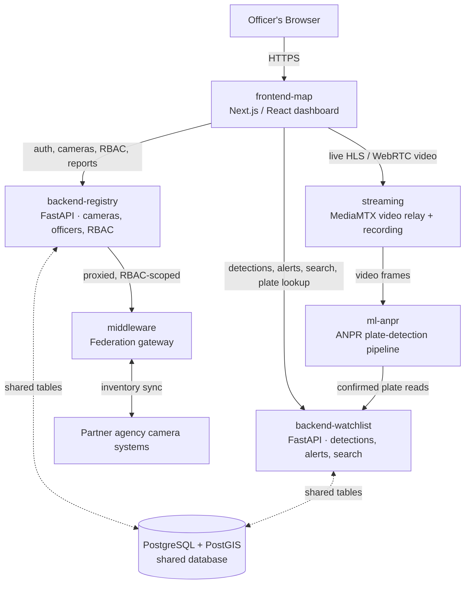

# DIGDHRISHTI

[](https://github.com/Pruthil-21/NETRA/actions/workflows/ci.yml)


**Real-time vehicle intelligence for a growing camera network.**

DIGDHRISHTI (Gujarati: "sharp/clear vision") is an ANPR (Automatic Number
Plate Recognition) surveillance and investigation platform built for Gujarat
Police under Smart India Hackathon. It turns a state-wide network of traffic
and CCTV cameras — today heterogeneous, siloed, and manually monitored — into
one searchable, alert-driven system: every plate a camera reads is recorded,
checked against a watchlist in real time, and turned into a traceable history
an officer can follow across the whole network in seconds instead of hours.

This document is written so both an engineer and a non-technical reviewer can
follow it end to end.

---

## Table of Contents

- [The Problem](#the-problem)
- [What It Does](#what-it-does)
- [How It's Built](#how-its-built)
- [Tech Stack](#tech-stack)
- [Repository Layout](#repository-layout)
- [Running It Locally](#running-it-locally)
- [Security & Access Control](#security--access-control)
- [Scalability](#scalability)
- [Roadmap](#roadmap)
- [Team](#team)

---

## The Problem

Government camera infrastructure in Gujarat is split across many departments —
different vendors, different video systems, no shared way to ask "has this
vehicle been seen anywhere today?" without an officer manually checking
camera by camera, hour by hour. A wanted or suspicious vehicle can pass a
dozen cameras before anyone notices, because nothing is watching the plates
themselves, only the video.

DIGDHRISHTI doesn't replace the existing camera hardware or video systems —
it sits on top of them: a unified registry, live view, and analytics layer
that reads every plate automatically and reacts to it immediately.

## What It Does

Every item below is a real, working page in the product — not a plan.

| Feature | In plain terms | Under the hood |
|---|---|---|
| **Live Operations Dashboard** | One screen showing every camera's live feed and whether it's online, organized by district. | A single server-side health sweep decides each camera's status — not every officer's browser separately pinging every camera — so it scales past a small camera count without flooding the network. |
| **Interactive Map** | See every camera on a map of Gujarat, plus heatmaps of where traffic is heaviest and which routes vehicles actually take between cameras. | The "Flow" layer pairs the same plate seen at two different cameras and snaps the path to the real road network via OSRM routing, instead of drawing a straight line through buildings. |
| **Search & Vehicle Trace** | Type a plate number, see everywhere it's been spotted, in order, on a map — including its likely next stop. | Consecutive sightings are used to infer direction and speed (never claimed as GPS tracking), and a "predicted next camera" is computed from the aggregate movement pattern of every vehicle that has passed the same checkpoint before. |
| **Watchlist Alerts** | The instant a flagged plate is spotted anywhere, an officer sees it, with the nearest police station and one-click acknowledge/escalate/dismiss. | Every action is permanently logged, and the officer who logs the first action can't be the one who escalates it — separation of duty, not just a checkbox. |
| **Archive & Playback** | Every camera's footage is continuously recorded and can be scrubbed to an exact date and time, then exported as a clip. | Recording is handled by a dedicated service, independent of who's watching live, so nothing is missed just because no one had the feed open. |
| **Manual Plate Lookup** | An officer can submit a phone video, a photo, or a marked clip from Archive for one-off plate extraction — no live camera required. | The submission is dispatched into the exact same detection → alert → trace pipeline as live traffic, so it's never a second, disconnected system. |
| **Reports & Analytics** | 24-hour operational counts, gaps in camera coverage, ageing/unreliable infrastructure, and a week of traffic-density history — the command-level view. | Coverage gaps are computed with real geographic distance queries (PostGIS) against planned checkpoint locations, not a guess. |
| **Admin Console** | Manage officers, roles, districts, camera inventory, and a full audit trail — without touching code. | A genuine role → duty → permission system (not five hardcoded roles): an admin composes roles from reusable permission bundles, and access is scoped per-district or platform-wide. |
| **Cross-Agency Federation** | Bring in camera feeds from other agencies' systems and map them into the same registry. | A gateway service brokers this so the browser authenticates once, through this platform's own login — the partner system's credentials never reach the browser. |

## How It's Built

DIGDHRISHTI is six independently-owned services, not one monolith — each can
be developed, tested, and deployed on its own.



| Service | Owns | Talks to |
|---|---|---|
| **`frontend-map`** | The entire officer-facing UI — the only UI in the system. | Both backend APIs over HTTPS, and the streaming service directly for live video. |
| **`backend-registry`** | Cameras, the district/taluka/village reference hierarchy, officer accounts, authentication, and the whole RBAC system. | Shares one Postgres instance with `backend-watchlist`; proxies to `middleware`. |
| **`backend-watchlist`** | Plate detections, watchlist matching, alerts, vehicle-trace analytics, Manual Plate Lookup job orchestration. | Receives detections from `ml-anpr`; reads camera/officer data from the shared database. |
| **`streaming`** | Live video ingestion, HLS/WebRTC relay, continuous recording. | Feeds frames to `ml-anpr`; serves video to `frontend-map`. |
| **`ml-anpr`** | The actual plate-detection model and inference pipeline. | Reports confirmed reads to `backend-watchlist`. |
| **`middleware`** | Cross-agency camera-inventory federation. | Bridges `backend-registry` to partner systems' own camera inventories. |

## Tech Stack

| Layer | Technology |
|---|---|
| Frontend | Next.js 16 (App Router), React 19, TypeScript, Tailwind CSS, Leaflet, Recharts |
| Backend APIs | Python 3.11, FastAPI, hand-written SQL (no ORM) |
| Database | PostgreSQL with PostGIS (geospatial queries) |
| Auth | JWT (HS256), a duty/permission-based RBAC model |
| Video | MediaMTX (HLS + WebRTC), continuous recording pipeline |
| Routing/analytics | OSRM (road-snapped routes), PostGIS distance queries |
| Notifications | Web Push (VAPID) |
| ANPR | Custom plate-detection inference pipeline |
| CI | GitHub Actions — independent test jobs per service |

## Repository Layout

```
NETRA/
├── frontend-map/       Officer-facing web app (Next.js)
├── backend-registry/   Cameras, officers, RBAC, reference data (FastAPI)
├── backend-watchlist/  Detections, alerts, watchlist, trace analytics (FastAPI)
├── streaming/          Video ingestion, relay, recording (MediaMTX)
├── ml-anpr/            ANPR plate-detection pipeline
├── middleware/         Cross-agency federation gateway
├── contract/           Shared API contract reference
├── docker-compose.yml  Local multi-service orchestration
├── SECURITY.md         Implemented vs. deferred security controls
└── SCALABILITY.md      Plan for scaling to ~80,000 cameras statewide
```

## Running It Locally

Each service can run standalone; `docker-compose.yml` at the repo root wires
them together for a full local stack. The short version, per service:

```bash
# backend-registry (FastAPI, port 8000 by default)
cd backend-registry && python -m venv venv && venv/Scripts/activate
pip install -r requirements.txt -r requirements-dev.txt
uvicorn app.main:app --reload --port 8000

# backend-watchlist (FastAPI, port 8001)
cd backend-watchlist && python -m venv venv && venv/Scripts/activate
pip install -r requirements-dev.txt
uvicorn app.main:app --reload --port 8001

# frontend-map (Next.js, port 3000)
cd frontend-map && npm install && npm run dev
```

Both backend services need a shared `DATABASE_URL` (PostgreSQL + PostGIS),
a common `JWT_SECRET`, and an `INTERNAL_SERVICE_KEY` for service-to-service
calls — see each service's `.env.example`. `streaming/` and `ml-anpr/` are
owned and run independently by their respective maintainers.

## Security & Access Control

Access is governed by a genuine role → duty → permission model, not a fixed
role list: permissions bundle into duties, duties assign to roles, and roles
attach to an officer via a posting scoped to one district or the whole
platform. An officer can hold multiple postings at once; effective access is
the union of all of them. Every permission boundary is enforced on the
backend — the frontend only hides what an officer can't use, for a cleaner
experience, never as the actual security control.

See [`SECURITY.md`](./SECURITY.md) for the full, honestly-scoped breakdown of
what's implemented versus deferred.

## Scalability

The current deployment runs a modest demonstration camera count; the
architecture is planned against a target of roughly 80,000 registered
cameras statewide. See [`SCALABILITY.md`](./SCALABILITY.md) for measured
behavior, capacity planning, and the specific tradeoffs made along the way
(such as live-relay-first video rather than centralized recording of every
feed).

## Roadmap

- **Push-based camera health**, replacing the current periodic sweep, so a
  camera going offline reflects instantly — necessary at full statewide scale.
- **Real government database integration** (VAHAN vehicle registration,
  eGujCop crime records, SARTHI driving licenses) once formal access is
  granted — these lookups exist today as honestly-labeled placeholders, never
  fabricated data.
- **Push-based federation updates** from partner agencies, replacing periodic
  polling.
- **A field-officer mobile app**, and a broader proactive anomaly-detection
  layer building on the improbable-speed/extended-gap heuristics already
  running on every vehicle trace.

## Team

Built by a six-member team for Smart India Hackathon:

| Area | Contributor(s) |
|---|---|
| Backend & Frontend | Pruthil |
| ML / ANPR & Backend | Avi |
| Backend (registry & watchlist) | Anushka |
| Frontend | Krishna, Vrunda |
| Streaming & Federation | Dhruv |

---

*This is a hackathon prototype, not a production deployment — capacity
figures and security controls are documented honestly as plans and
partial implementations, not finished guarantees. See `SECURITY.md` and
`SCALABILITY.md` for specifics.*
